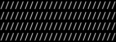

# Zellij Slashes Pane

> [!TIP]
> This template is a starting point you can use for every Zellij plugin. We offer:
>
> * Clear structure and quick notes
> * Install/upgrade instructions which allow your customers to avoid compiling
> * Continuous integration to [check formatting](.github/workflows/lint.yml) and [build and test](.github/workflows/build-test.yml)
> * A render snapshot checked by [tests/snapshot.sh](tests/snapshot.sh), using [Zellij Plugin Snapshot](https://github.com/fulldecent/zellij-plugin-snapshot)
> * Automated releases with [Release Please](.github/workflows/release.yml) and SLSA provenance attestation
> * A shared [Rust toolchain](rust-toolchain.toml) for local development and CI
> * A minimal implementation to extend, which is suitable for every plugin type (status bar, tab bar, pane, floating pane)
>
> If a more specific template applies, use that instead:
>
> * [project-template](https://github.com/fulldecent/project-template): any project
> * [rust-template](https://github.com/fulldecent/rust-template): Rust applications and libraries
>
> What is in-scope for this template?
>
> We the people who manage Zellij plugins, in order to advocate for a safer installation path and great defaults, maintain this starting point for plugin projects.
>
> This zellij-plugin-template must remain broad—addressing the needs of many kinds of Zellij plugins. Every project deserves a README, and a clear rule on basic formatting questions, this is why we include continuous integration linting.
>
> We do not specify that GitHub and GitHub Actions are the only way to host projects, others may consider our GitHub-specific notes as a starting point guide for implementing outside of GitHub.
>
> And now below is the template, shown for a specific hypothetical project, enjoy!

[](https://github.com/fulldecent/zellij-plugin-template/actions/workflows/lint.yml) [](https://github.com/fulldecent/zellij-plugin-template/actions/workflows/build-test.yml)

A Zellij pane filled with slash characters. It needs no permissions. It is just slashes.

Zellij Slashes Pane offers:

* A wasm you can drop into `~/.config/zellij/plugins` without compiling
* A stable reverse-DNS file name so upgrades overwrite the same path
* A signed sidecar next to that file so you can check which release you installed



This is a [Zellij](https://zellij.dev/) plugin and supports the latest active release of Zellij.

> [!NOTE]
> After you use the template, replace "Zellij Slashes Pane" and the sentence above with what your project does, and the badge URL. If you can, include screenshots/graphics to fill in that placeholder. Because you have just six seconds to pique a person's interest!
>
> Also update the reverse-DNS plugin file name (`com.github.fulldecent.zellij-plugin-template.wasm`) to match your GitHub owner and repository, and the description in Cargo.toml.

## Try it out

1. Select the latest wasm release and install to your plugins folder:

   ```sh
   name="com.github.fulldecent.zellij-plugin-template.wasm"
   base="https://github.com/fulldecent/zellij-plugin-template/releases/latest/download"
   mkdir -p ~/.config/zellij/plugins
   curl -fL -o ~/.config/zellij/plugins/"$name" "$base/$name"
   curl -fL -o ~/.config/zellij/plugins/"${name}.sigstore.jsonl" "$base/${name}.sigstore.jsonl"
   ```

   The release asset names match this local file. `curl -f` fails if the wasm or the sidecar is missing.

   Check the file against the sidecar:

   ```sh
   gh attestation verify ~/.config/zellij/plugins/"$name" \
     -R fulldecent/zellij-plugin-template \
     --bundle ~/.config/zellij/plugins/"${name}.sigstore.jsonl"
   ```

2. Now open Zellij and try the plugin from inside it (without adding it to your layout yet):

   ```sh
   zellij
   
   # Run this next command from INSIDE your Zellij session
   zellij action start-or-reload-plugin "file:${HOME}/.config/zellij/plugins/com.github.fulldecent.zellij-plugin-template.wasm"
   ```

## Installation

Complete the [try it out instructions](#try-it-out) above to download the plugin.

You will now be adding this plugin to your default layout.

1. First, create a default layout if you don't already have one:

   ```sh
   mkdir -p ~/.config/zellij/layouts
   DEST=~/.config/zellij/layouts/default.kdl
   [ -f "$DEST" ] || zellij setup --dump-layout default > $DEST
   ```

2. Then, replace `tab-bar` with this plugin:

   ```diff
   - plugin location="tab-bar"
   + plugin location="file:~/.config/zellij/plugins/com.github.fulldecent.zellij-plugin-template.wasm"
   ```

   Or, non-interactively:

   ```sh
   plugin="${HOME}/.config/zellij/plugins/com.github.fulldecent.zellij-plugin-template.wasm"
   DEST=~/.config/zellij/layouts/default.kdl
   # macOS sed writes the file in place. Replaces tab-bar or an older copy of this plugin.
   sed -i '' \
     -e "s|plugin location=\"tab-bar\"|plugin location=\"file:${plugin}\"|" \
     -e "s|plugin location=\"file:.*com.github.fulldecent.zellij-plugin-template\\.wasm\"|plugin location=\"file:${plugin}\"|" \
     -e "s|plugin location=\"file:.*fulldecent-zellij-plugin-template-.*\\.wasm\"|plugin location=\"file:${plugin}\"|" \
     "$DEST"
   ```

Repeat the same try it out + installation steps to upgrade. The wasm file name is stable, so upgrading overwrites that file and your layout path stays the same. The sidecar next to it records which release version you downloaded.

> [!NOTE]
> If your project requires some installation process to use it, explain that here. If not, delete this section.
>
> Other common names for this section include: getting started, setup.
>
> Please consider that people using your project may not care about the technology you build it on. That means explaining those technologies (at least their setup) is in-scope for your project setup instructions.
>
> Modify the layout instructions if your plugin is something other than a tab bar replacement.
>
> Some technologies have offensive install instructions, e.g. `curl|sh`. You should avoid linking to those websites and invest the time to make better instructions for your customers.

## Usage

From inside a Zellij session, load the plugin as a pane:

```sh
zellij action start-or-reload-plugin "file:${HOME}/.config/zellij/plugins/com.github.fulldecent.zellij-plugin-template.wasm"
```

The pane fills its area with slash characters in your theme colors. It does not require any permissions.

> [!NOTE]
> Explain how to use your project. Or link to the canonical usage instructions.
>
> Other common names for this section include: "how to...".

## Development

Thank you for taking an interest in improving Zellij Slashes Pane and the Zellij sessions of people using this project!

You will need [rustup](https://rust-lang.github.io/rustup/), Git and your platform's native build tools. rustup is the Rust toolchain manager. This project pins the toolchain in [rust-toolchain.toml](rust-toolchain.toml); rustup reads that file and installs matching `rustc`, Cargo, rustfmt, Clippy and the `wasm32-wasip1` target.

A packaged `rustc` or `cargo` from apt, dnf or Homebrew does not apply `rust-toolchain.toml`. Install rustup, then invoke the toolchain rustup selected:

```sh
"$(rustup which rustc)" --version
"$(rustup which cargo)" --version
```

`rustup which` prints the binary for the active toolchain (from `rust-toolchain.toml` in this directory). Quoting the command substitution runs that binary even when another `rustc` or `cargo` is earlier on `PATH`.

### Linux

On Ubuntu 22.04+ or Debian 12+:

```sh
sudo apt update
sudo apt install git build-essential rustup
```

On Fedora:

```sh
sudo dnf install git gcc rustup
```

If your distribution has no `rustup` package, follow [other rustup installation methods](https://rust-lang.github.io/rustup/installation/other.html).

### macOS

Install Apple's Command Line Tools if they are not already installed:

```sh
xcode-select --install
```

Complete the installation dialog; these tools supply the linker and SDK. With Homebrew installed, install Git and rustup:

```sh
brew install git rustup
```

Homebrew's `rust` formula is a standalone compiler. It does not honor `rust-toolchain.toml`. Use `rustup` instead.

### Windows

Use winget to install Git, the native build tools and rustup:

```powershell
winget install --exact --id Git.Git
winget install --exact --id Microsoft.VisualStudio.2022.BuildTools --override "--wait --passive --norestart --add Microsoft.VisualStudio.Workload.VCTools --includeRecommended"
winget install --exact --id Rustlang.Rustup
```

Allow administrator prompts and wait for installation to finish. Open a new PowerShell window so rustup is on `PATH`.

Clone the project and build:

```sh
git clone https://github.com/fulldecent/zellij-plugin-template.git
cd zellij-plugin-template
"$(rustup which rustc)" --version
"$(rustup which cargo)" --version
"$(rustup which cargo)" check --locked
"$(rustup which cargo)" build --locked
```

In PowerShell:

```powershell
& (rustup which rustc) --version
& (rustup which cargo) --version
& (rustup which cargo) check --locked
& (rustup which cargo) build --locked
```

Run this directly with:

```sh
zellij --layout layout/plugin-dev.pane.kdl
zellij --layout layout/plugin-dev.floating-pane.kdl
zellij --layout layout/plugin-dev.tab-bar.kdl
zellij --layout layout/plugin-dev.status-bar.kdl
```

Or in an existing session, access a shell and use:

```sh
zellij action start-or-reload-plugin file:target/wasm32-wasip1/debug/plugin.wasm
```

> [!NOTE]
> If your project requires some system configuration process to contribute to your project, explain that here. If not, delete this section.
>
> Other common names for this section include: contributing, get involved. It is a higher level of commitment than just using your product.
>
> Keep all just one of the layout files, depending on what kind of plugin you have. Delete those unused files in the layout/ folder.
>
> And the `start-or-reload-plugin` example only makes sense if you are using a pane type.

### Testing

All project updates that we release must conform to our test suite. We have set our GitHub so that each commit automatically runs these tests and calls out any problems. But you can also run it locally on your computer before you send in commits and pull requests.

```sh
"$(rustup which cargo)" test --locked --target "$("$(rustup which rustc)" -vV | sed -n 's/^host: //p')"
"$(rustup which cargo)" fmt --all -- --check
"$(rustup which cargo)" clippy --all-targets --locked -- -D warnings
"$(rustup which cargo)" build --release --locked
```

`cargo test` runs the Rust tests in `src/main.rs`. [tests/snapshot.sh](tests/snapshot.sh) builds the release wasm, runs [shots/screenshot.yaml](shots/screenshot.yaml), and exits non-zero unless those bytes match [shots/screenshot.ansi.txt](shots/screenshot.ansi.txt).

The host is [Zellij Plugin Snapshot](https://github.com/fulldecent/zellij-plugin-snapshot) 0.2.2. Install that published crate once. `cargo install` compiles it and puts `zellij-plugin-snapshot` on `PATH`. `[dependencies]` and `[dev-dependencies]` link a library into the plugin wasm or into `cargo test`. This host is a command, so those fields leave it uninstalled.

```sh
"$(rustup which cargo)" install zellij-plugin-snapshot --version 0.2.2 --locked
sh tests/snapshot.sh
```

[screenshot.svg](screenshot.svg) is that same pane, shown above. The test compares the ANSI file. When the picture should change, write both files again:

```sh
zellij-plugin-snapshot shots/screenshot.yaml --out /tmp/shots
cp /tmp/shots/screenshot.ansi.txt shots/screenshot.ansi.txt
cp /tmp/shots/screenshot.svg screenshot.svg
```

`tests/snapshot.sh` passes `--target wasm32-wasip1`. [.cargo/config.toml](.cargo/config.toml) selects that target for a plain `cargo build`. The flag keeps the snapshot build on the plugin wasm if that default is removed.

If you have an actively maintained version of Node.js installed, you can use this command to correct most formatting issues in your copy of this project. Please do that before sending proposed changes.

```sh
npx prettier@latest --check . --write
npx markdownlint-cli@latest "**/*.md" --fix
```

> [!NOTE]
> Other common names for this section include: validation, checks.

### Releases

Use `fix:`, `feat:` or `BREAKING CHANGE:` in your commit messages. This will trigger our bot to make a new "release draft" pull request. Merging that pull request triggers a new tag and GitHub Release.

The [release workflow](.github/workflows/release.yml) uses Release Please's `simple` release type. Set the version in [Cargo.toml](Cargo.toml) and [Cargo.lock](Cargo.lock) to the proposed release version before merging the release pull request.

[Build and test](.github/workflows/build-test.yml) builds and tests the release wasm, then attests and uploads it. The release includes `com.github.fulldecent.zellij-plugin-template.wasm` and `com.github.fulldecent.zellij-plugin-template.wasm.sigstore.jsonl`, containing build provenance and version attestations. The wasm file name is stable across versions; the sidecar records the version.

> [!NOTE]
> In your GitHub repository settings, under Actions, General, Workflow permissions, select read and write permissions and check "Allow GitHub Actions to create and approve pull requests". Under General, Releases, enable release immutability. Attestations are available for public repositories; private repositories require GitHub Enterprise Cloud. Release Please needs write access to open the release draft pull request.
>
> Run these commands from a clone of the new repository. `gh` fills in `{owner}/{repo}` from that clone.
>
> List tags:
>
> ```sh
> gh api repos/{owner}/{repo}/tags --jq '.[].name'
> ```
>
> Set the starting tag on the current `main` commit. `v0.0.0` is the version Release Please counts forward from. Use another `vMAJOR.MINOR.PATCH` tag when this repository should start later.
>
> ```sh
> gh api --method POST repos/{owner}/{repo}/git/refs \
>   -f ref="refs/tags/v0.0.0" \
>   -f sha="$(gh api repos/{owner}/{repo}/commits/main --jq .sha)"
> ```
>
> `gh release list` and `gh release create` publish the releases this workflow creates after that tag.

### Maintenance

The project administrator completes these maintenance tasks each month. If they are 3+ months late, please remind them or send your own issue/pull request.

1. Identify external Actions in [.github/workflows](./.github/workflows) scripts and look for available new versions. Review and then update to the new version if it is safe. GitHub-supported Actions (i.e. under the actions/ organization) may require only cursory review.
1. Review the Rust toolchain in `rust-toolchain.toml`. Update it when a newer stable version is appropriate.
1. Review [zellij-plugin-snapshot](https://github.com/fulldecent/zellij-plugin-snapshot) releases. Update every `cargo install zellij-plugin-snapshot --version` line to that same published version. Regenerate [shots/screenshot.ansi.txt](shots/screenshot.ansi.txt) and [screenshot.svg](screenshot.svg) when the host output changes.

## Project scope

We are people who write Zellij plugins and we see every day how a small starting point with signed releases and snapshots saves time.

This Zellij Slashes Pane kit includes a slash-filled pane you can extend for any plugin type, with careful attention to keep the project suitable for a wide variety of plugins.

We specifically will not point layouts at an HTTPS plugin URL.

> [!NOTE]
> In the first paragraph, briefly introduce your community, who they are and why they care.
>
> After that, add your project's scope. This tells people what kinds of things you care about. This inspires people to become *contributors* here when they are doing their own work and see that their work is also welcome here.
>
> Last, it is good to also say what is out-of-scope. These exclusions serve the same purpose and demonstrate that you are thoughtful about your scoping.

## References

1. We use "Title Case" only for proper nouns, this includes the name of our project. We have a separate style guide for other word choice and typography decisions we have settled on.
1. This project is built based on [best practices documented in zellij-plugin-template](https://github.com/fulldecent/zellij-plugin-template), release 1.0.0.
1. This project is built based on [best practices documented in rust-template](https://github.com/fulldecent/rust-template/), release 1.0.0.
1. This project is built based on [best practices documented in project-template](https://github.com/fulldecent/project-template), release v1.3.0.
1. Zellij offers another installation method that is simpler and insecure. That points your layout configuration to a HTTPS URL. We consider that feature wrong and deprecated. [TODO: create and link upstream issue]
1. We speak of the official rustup installation recommendation as ugly. [Reported upstream](https://github.com/rust-lang/rust/issues/163468).
1. Render snapshots follow [Zellij Plugin Snapshot](https://github.com/fulldecent/zellij-plugin-snapshot) 0.2.2. Installation follows [`cargo install`](https://doc.rust-lang.org/cargo/commands/cargo-install.html). The test compares [shots/screenshot.ansi.txt](shots/screenshot.ansi.txt). [screenshot.svg](screenshot.svg) is the picture in this README.
1. The Rust ignore rules in [.gitignore](.gitignore) come from [GitHub's Rust gitignore](https://github.com/github/gitignore/blob/main/Rust.gitignore).
1. This project is released under the [MIT license](./LICENSE.md).

> [!NOTE]
> We use an MIT license for this template. You should carefully consider which license to apply to your own project. Replace the copyright line in LICENSE.md.
>
> We cite a non-existent style guide here. You may add one or add your own rules, to achieve a consistent voice even with diverse contributors.
>
> If your project materially relied on external sources to make some decisions, cite them here.
